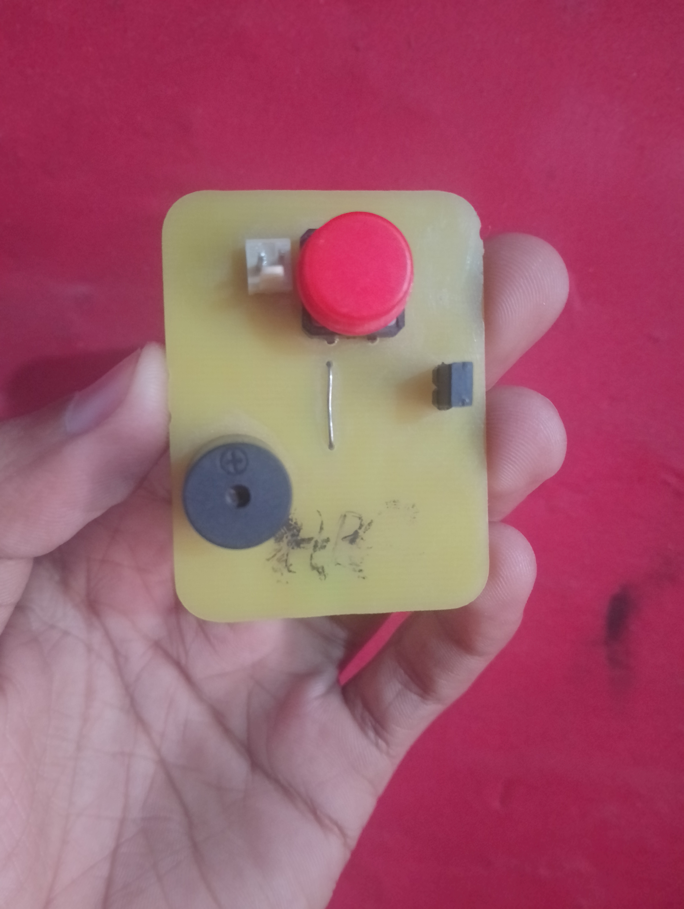
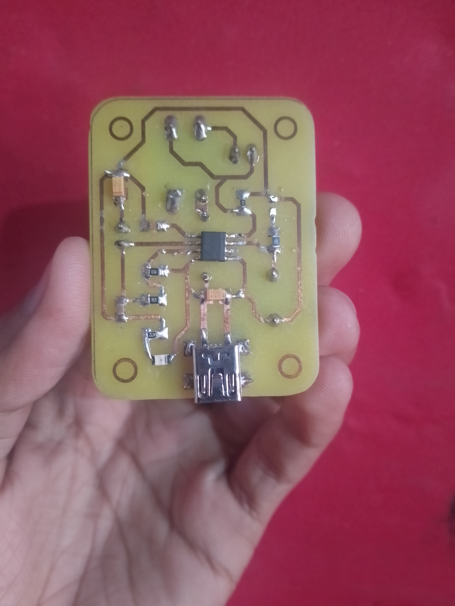

# Morse Code
Morse code is a Device build using a 555 timer IC, a buzzer, LEDs, capacitors, and resistors. The device generates audible and visual Morse code signals, allowing the user to send messages using the internationally recognized Morse code format.

# Components Needed :

* 555 Timer IC: The core component used to generate timed pulses.

* Buzzer: Produces audible Morse code signals.

* LED: Provides visual Morse code signals.

* Capacitors: Used for timing control in the 555 timer circuit.

* Resistors: Set the timing intervals for the 555 timer and control current to the LED.

* Push Button: Allows the user to manually create Morse code signals.

    
    

# Circuit Description 

The 555 timer IC is configured in astable mode to generate a square wave output. This output is used to drive both the buzzer and the LED. When the push button is pressed, the 555 timer produces pulses, creating dots and dashes corresponding to the duration of the button press.

# Features :

* Dual Output Signals: Provides both audible (buzzer) and visual (LED) Morse code signals.

* Manual Control: Allows the user to manually generate Morse code by pressing the button.

* Educational Tool: Helps in learning about Morse code and basic electronics.

# Applications :

* Communication: Useful for basic communication in Morse code, particularly in amateur radio and emergency situations.
* Educational Purposes: Ideal for learning and teaching Morse code and electronics principles.